# RouteToDev – Interactive Learning Platform

An interactive learning app with quizzes, payments, and progress tracking.

<!-- Tech badges -->


## 🚧 Live Demo
- Not currently deployed. Run locally as described below (portfolio project).

## 📸 Screenshots

### **Homepage & Learning Paths**
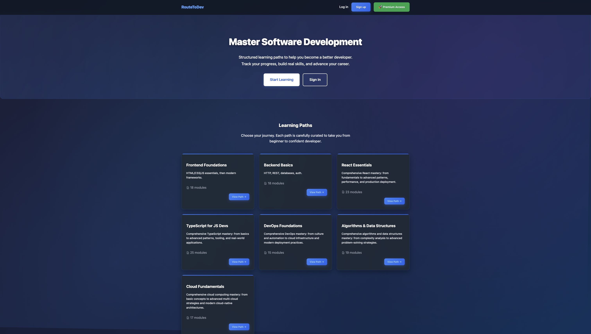
*Clean, modern homepage with learning paths and progress tracking*

### **User Authentication**
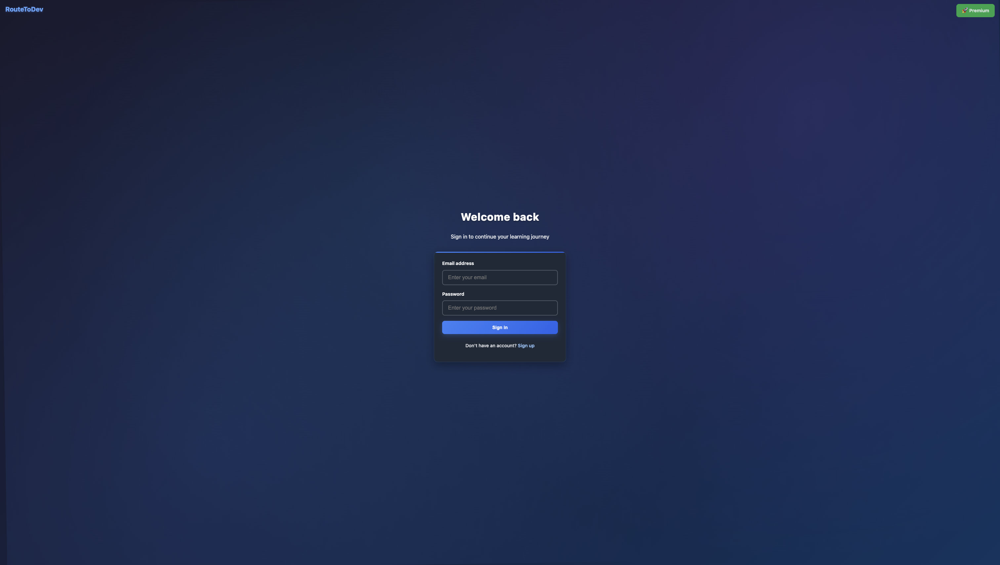
*Secure login interface with email verification*

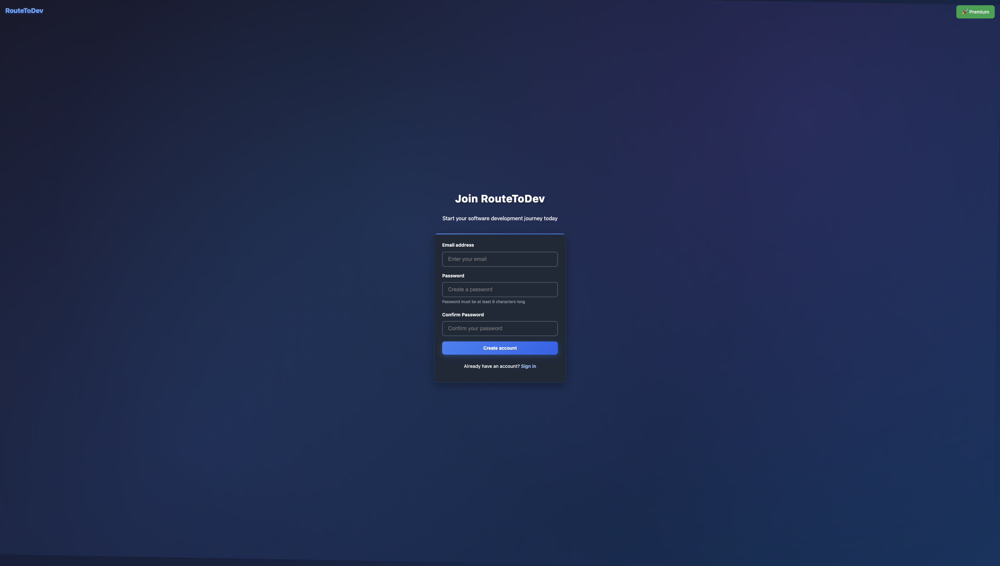
*User registration with password confirmation*

### **Learning Interface**
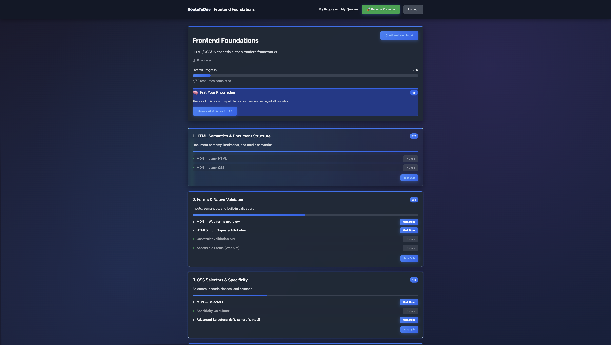
*Interactive learning path with modules and progress indicators*


### **Quiz System**
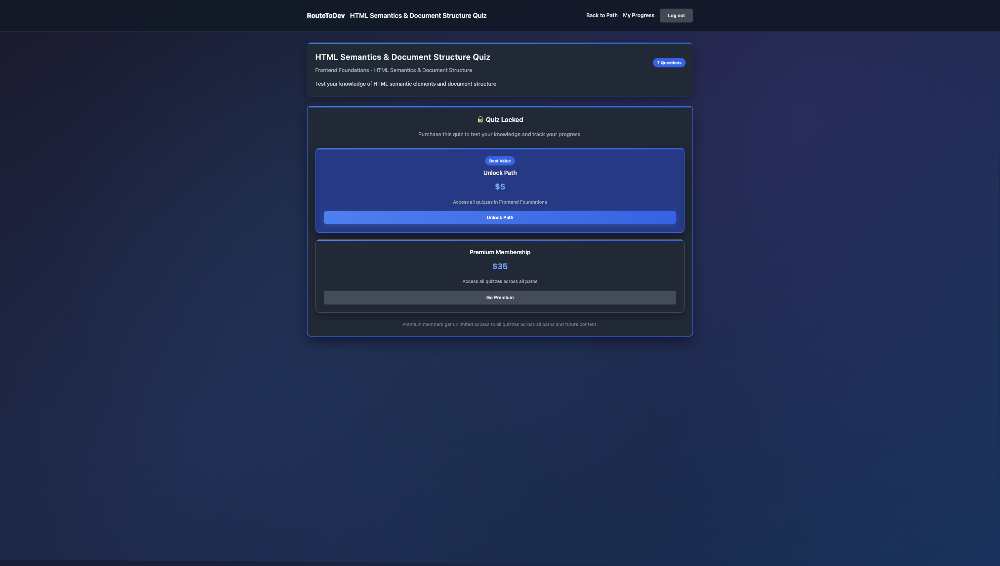
*Interactive menu for quiz-purchases*

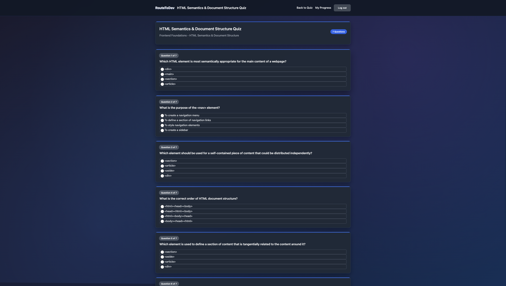
*Interactive quiz with multiple-choice questions*

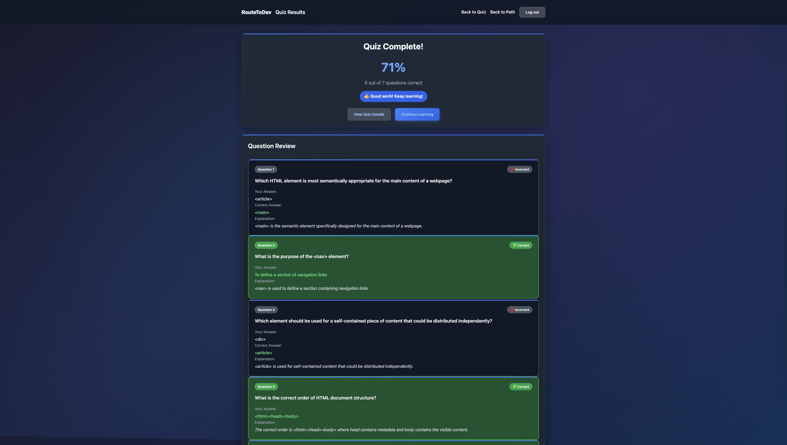
*Detailed quiz results with explanations and scoring*

### **Payment Integration**
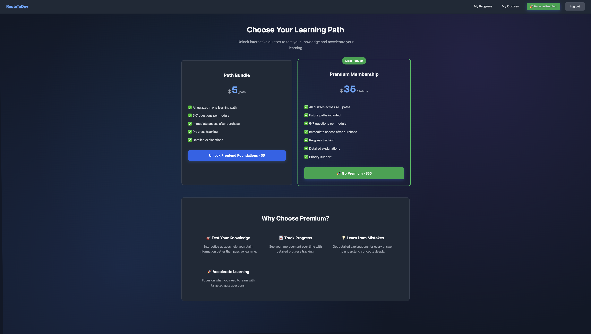
*Transparent pricing with multiple subscription tiers*

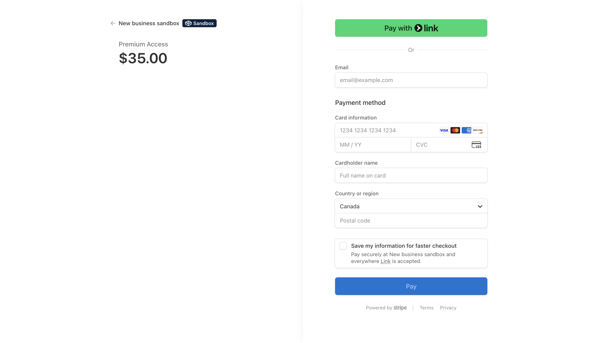
*Secure Stripe payment integration*

### **User Dashboard**
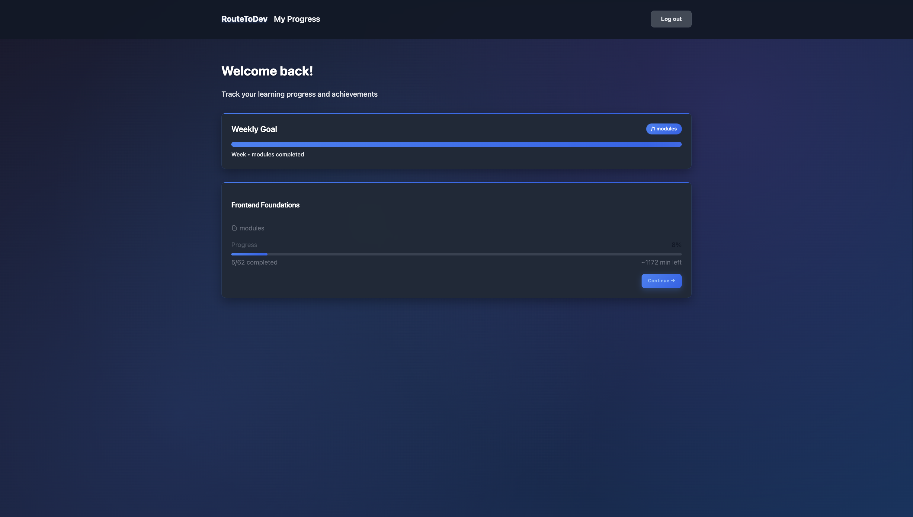
*Personalized dashboard with learning progress*

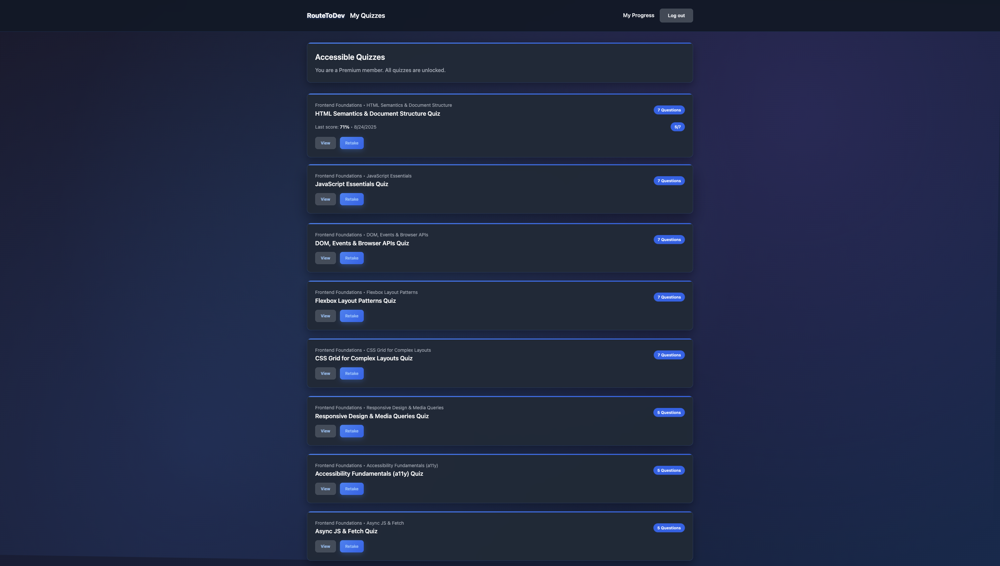
*Quiz attempt history and performance analytics*

## 🎯 Features

### Core Learning Platform
- **Learning Paths**: Structured modules with prerequisites
- **Resource Library**: Articles, videos, and exercises per module
- **Progress Tracking**: Visual indicators and completion states
- **Authentication**: Email/password auth with sessions

### Quiz System
- **Interactive Quizzes**: Timed multiple-choice quizzes per module
- **Results & Explanations**: Correct answers with reasoning
- **Attempt History**: View past attempts and scores
- **Difficulty Levels**: Beginner, intermediate, advanced

### Payments
- **Stripe Checkout**: Secure payment flow
- **Pricing Tiers**:
  - Path Bundle: $5 – unlocks quizzes for a single path
  - Premium: $35 – unlocks quizzes across all paths
- **Access Control**: Purchases grant quiz access

### User Experience
- **Responsive UI**: Desktop and mobile friendly
- **Dark Theme**: Eye-friendly color palette
- **Live Updates**: Instant progress feedback
- **Email Verification**: Secure account activation (skippable in dev)

## 🛠 Technology Stack

### Frontend
- **EJS** for server-rendered views
- **CSS** with a clean, modern dark theme
- **Vanilla JS** for interactivity

### Backend
- **Node.js** + **Express.js**
- **TypeScript** (strict, type-safe server code)
- **Winston + Morgan** for logging
- **Helmet**, **csurf**, **express-session**, **rate-limit** for security
- **Prisma ORM** for database access

### Database
- **PostgreSQL** (primary)

### Authentication & Security
- **bcrypt** password hashing
- **Session-based auth** (cookies)
- **CSRF protection**, **CSP/Helmet**, **rate limiting**

### Payments & Email
- **Stripe** Checkout Sessions
- **SendGrid** email verification

### Dev Tools
- **Prisma Studio** (data explorer)
- **ts-node-dev** (live-reload dev server)
- **dotenv** (env management)

## 📁 Project Structure

```
RouteToDev/
├── prisma/                # Database schema and migrations
│   ├── schema.prisma      # Database schema definition
│   ├── migrations/        # Database migration files
│   └── seed.ts           # Database seeding script
├── public/               # Static assets (CSS)
├── src/                  # App source
│   ├── server.ts         # Express app
│   ├── views/            # EJS templates
│   └── types/            # TS ambient types
└── package.json          # Dependencies and scripts
```

## 🚀 Getting Started

### Prerequisites
- Node.js 18+
- PostgreSQL
- Stripe account (test mode is fine)
- SendGrid account (for verification emails)

### Installation

1. **Clone the repository**
   ```bash
   git clone https://github.com/yourusername/RouteToDev.git
   cd RouteToDev
   ```

2. **Install dependencies**
   ```bash
   npm install
   ```

3. **Set up environment variables**
   ```bash
   cp .env.example .env
   # Edit .env with your configuration
   ```

4. **Set up the database**
   ```bash
   npx prisma migrate dev
   npx prisma db seed
   ```

5. **Start the development server**
   ```bash
   npm run dev
   ```

### Environment Variables

```env
# Database
DATABASE_URL="postgresql://..."

# Session
SESSION_SECRET="your-secret-key"

# Stripe
STRIPE_SECRET_KEY="sk_test_..."
STRIPE_WEBHOOK_SECRET="whsec_..."
STRIPE_PRICE_PATH_USD="price_..."
STRIPE_PRICE_PREMIUM_USD="price_..."

# SendGrid
SENDGRID_API_KEY="SG..."
SENDGRID_FROM_EMAIL="noreply@yourdomain.com"

# App
BASE_URL="http://localhost:3000"
NODE_ENV="development"
```

## ✅ Key Features Implemented

### Learning Management
- ✅ Structured learning paths with modules
- ✅ Progress tracking and completion status
- ✅ Resource management (articles, videos, exercises)
- ✅ User progress visualization

### Quiz System
- ✅ Interactive multiple-choice quizzes
- ✅ Score tracking and performance analytics
- ✅ Detailed feedback and explanations
- ✅ Quiz attempt history

### Payment Integration
- ✅ Stripe payment processing
- ✅ Multiple pricing tiers
- ✅ Webhook handling for payment verification
- ✅ Access control based on purchases

### User Management
- ✅ User registration and authentication
- ✅ Email verification system
- ✅ Session management
- ✅ Role-based access control

### Security Features
- ✅ Password hashing with bcrypt
- ✅ CSRF protection
- ✅ Rate limiting
- ✅ Security headers with Helmet
- ✅ Input validation and sanitization

## 🚀 Deployment

### Vercel (optional)
Previously deployed during testing; currently not live. You can deploy to Vercel by building the server and configuring environment variables there.

### Local Development
Run with `npm run dev`. Use Prisma Studio with `npx prisma studio`.

## 🧪 Testing

### **Manual Testing**
- User registration and login
- Email verification flow
- Quiz taking and scoring
- Payment processing (Stripe test mode)
- Progress tracking

### **API Testing**
- Authentication endpoints
- Quiz endpoints
- Payment webhooks
- Progress tracking

## 📊 Performance & Optimization

- **Database Indexing**: Optimized queries with proper indexes
- **Caching**: Session-based caching for user data
- **Compression**: Gzip compression for static assets
- **Rate Limiting**: API protection and abuse prevention

## 🔒 Security Considerations

- **Password Security**: bcrypt hashing with salt rounds
- **Session Security**: Secure session configuration
- **CSRF Protection**: Cross-site request forgery prevention
- **Input Validation**: Server-side validation for all inputs
- **SQL Injection Prevention**: Parameterized queries with Prisma
- **XSS Protection**: Content Security Policy headers

## 🎨 UI/UX

- **Modern Interface**: Clean, professional design
- **Dark Theme**: Eye-friendly color scheme
- **Responsive Design**: Mobile-first approach
- **Accessibility**: WCAG compliant design
- **User Feedback**: Clear success/error messages

## 📈 Future Enhancements

- [ ] Real-time notifications
- [ ] Social learning features
- [ ] Advanced analytics dashboard
- [ ] Mobile app development
- [ ] AI-powered quiz generation
- [ ] Multi-language support
- [ ] Advanced payment options
- [ ] Learning path customization

## 🤝 Contributing

This is a portfolio project, but contributions are welcome for learning purposes.

## 📄 License

This project is for educational and portfolio purposes.

## 👨‍💻 Author

**Jaspreet Multani**
- Linkedin: (https://www.linkedin.com/in/jmultani/)
- GitHub: (https://github.com/JaspreetMultani)
- Portfolio: (https://jaspreetmultani.com/)

---

Built with ❤️ for learning and portfolio showcase
